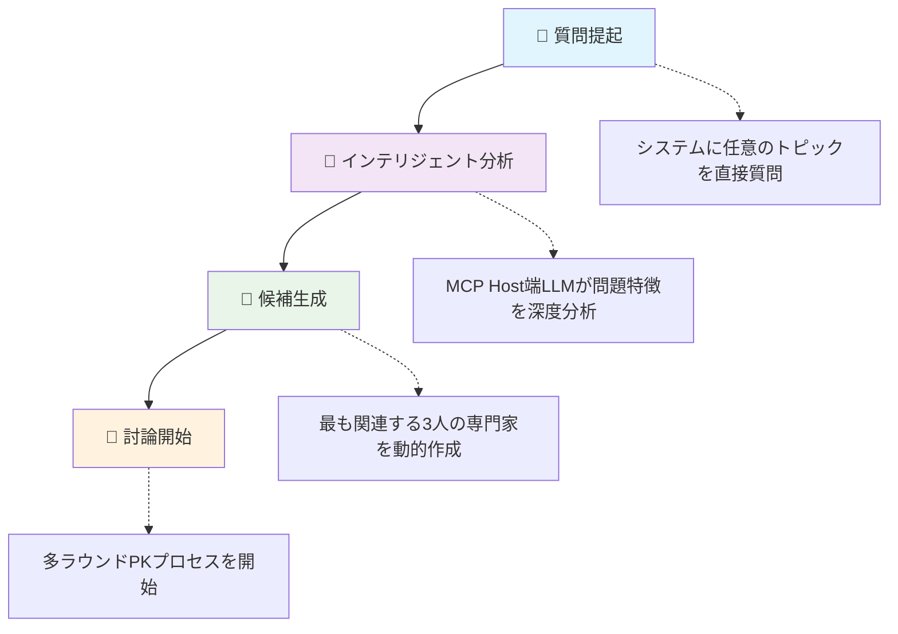
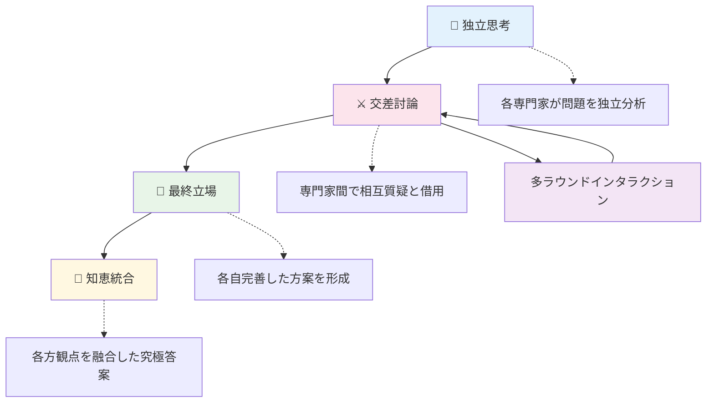

# 📚 Language Versions | 多语言版本 | 言語バージョン

🌐 **[English](README.md)** | 🇨🇳 **[中文](README_zh.md)** | 🇯🇵 **[日本語](README_ja.md)**

---

## Guru-PK MCP インテリジェント専門家討論システム

ローカルMCP（Model Context Protocol）ベースのAI専門家討論システム。**動的専門家生成アーキテクチャ**を採用し、問題に応じて最適な専門家の組み合わせを知的に生成し、多ラウンドの知恵の衝突を行います。

## ✨ コア機能

- 🏭 **動的専門家生成** - 問題完全駆動、毎回専用の専門家組み合わせを生成
- 🌟 **無限専門家プール** - 固定専門家制限を突破、任意分野の専門家生成をサポート
- 🔄 **多ラウンドPKフロー** - 独立思考 → 交差討論 → 最終立場 → 知恵統合
- 🎨 **タフテスタイル情報図** - 専門家討論をデータビジュアライゼーション大師エドワード・タフテの設計原則に厳格に従った単一ページ動的情報図に変換
- 🤖 **インテリジェント分業アーキテクチャ** - MCP Host端LLMがインテリジェント分析を担当、MCP Server端がプロセスガイダンスを提供

## 🌐 オンラインデモ

**👉 [情報図デモを見る](https://mitsudoai.github.io/guru-pk-mcp/)**

このWebページは、このMCPツールで作成されたタフテスタイル動的情報図を表示し、専門家討論システムの強力な機能を直感的に示しています。

## 🚀 クイックインストール

### 1. 依存関係のインストール

**方法1：インストールスクリプトを使用（推奨）**

**macOS/Linux:**

```bash
curl -LsSf https://astral.sh/uv/install.sh | sh
```

**Windows:**

```powershell
powershell -ExecutionPolicy ByPass -c "irm https://astral.sh/uv/install.ps1 | iex"
```

**方法2：pipを使用してインストール（全プラットフォーム適用）**

```bash
pip install uv
```

**方法3：インストールパッケージをダウンロード**

[UV Releases](https://github.com/astral-sh/uv/releases) ページから対応プラットフォームのインストールパッケージをダウンロード

### 2. MCPクライアントの設定

**推奨方法：PyPIからインストール**

```json
{
  "mcpServers": {
    "guru-pk": {
      "command": "uvx",
      "args": ["--from", "guru-pk-mcp", "guru-pk-mcp-server"],
      "env": {
        "DATA_DIR": "~/.guru-pk-data"  // macOS/Linux: ~/ディレクトリ, Windows: %USERPROFILE%ディレクトリ
      }
    }
  }
}
```

> **更新説明**:
>
> - `guru-pk-mcp`を最新版に更新する必要がある場合は、以下のコマンドを実行してください：
>
>   ```bash
>   uvx pip install --upgrade guru-pk-mcp
>   ```
>
> - このコマンドはPyPIから最新リリース版を取得してインストールします
> - キャッシュの問題が発生した場合は、強制リフレッシュできます：
>
>   ```bash
>   uvx --refresh-package guru-pk-mcp --from guru-pk-mcp python -c "print('✅ UVXキャッシュがリフレッシュされました')"
>   ```
>
> **注意**:
>
> - macOSユーザーは完全パスの使用が必要な場合があります：`/Users/{ユーザー名}/.local/bin/uvx`
> - Windowsユーザー：`~`は自動的にユーザーホームディレクトリ（例：`C:\\Users\\{ユーザー名}`）に解析されます、手動修正不要

**開発方法：ソースコードからインストール**

```json
{
  "mcpServers": {
    "guru-pk": {
      "command": "uvx", 
      "args": ["--from", "/path/to/guru-pk-mcp", "guru-pk-mcp-server"],
      "env": {
        "DATA_DIR": "~/.guru-pk-data"  // macOS/Linux: ~/ディレクトリ, Windows: %USERPROFILE%ディレクトリ
      }
    }
  }
}
```

> **ローカル開発説明**:
>
> - ローカル開発シナリオでは、uvxキャッシュをリフレッシュする必要がある場合は、`make refresh-uvx`を使用してください
> - このコマンドはUVXにローカルパッケージを強制再インストールさせ、最新のコード変更を使用することを保証します

## 使用入門

MCPクライアントを再起動し、`guru_pk_help`と入力してヘルプを取得するか、直接質問して専門家討論を開始してください！

```javascript
// 1. 自然言語質問（最推奨の使用方法）
生成AIの分野で、個人起業に特に適した方向はありますか？3人の専門家にPKしてもらってください

// 2. インテリジェント候補専門家生成（システム自動実行）
start_pk_session: 生成AIの分野で、個人起業に特に適した方向はありますか？

// 3. インテリジェント候補専門家生成（ユーザーが期待する専門家範囲を限定）
start_pk_session: 生成AIの分野で、個人起業に特に適した方向はありますか？ AI分野の大物2人と著名な個人起業家1人で討論してください
```

### 💡 使用のヒント

**討論開始**：

- 🤖 **`start_pk_session:直接質問`** - デフォルト高効率バッチ処理モード（推奨）
- 🔄 **`start_stepwise_pk_session:直接質問`** - 従来の段階的対話モード

**ツール機能**：

- 📋 `guru_pk_help` - システム紹介と詳細ヘルプを取得
- 📄 `export_session` - セッションをMarkdownファイルとしてエクスポート
- 🎨 `export_session_as_infographic` - セッションをタフテスタイル単一ページ動的情報図としてエクスポート
- 📄 `export_enhanced_session` - 強化分析レポートをエクスポート
- 🌍 `set_language` - 専門家回答言語を設定

### 📱 互換性

全てのMCP互換アプリをサポート：Claude Desktop、Cursor、TRAE、DeepChat、Cherry Studioなど

### 🎯 推奨設定

**最推奨MCPホスト**：

- 💰 **ユーザーリクエスト計算のサブスクリプション制MCPホスト** - CursorやTrae海外版など
- 🌟 **メリット**：
  - コスト優位性が顕著：ユーザーリクエスト計算のサブスクリプション制課金、API呼び出し回数やtoken課金ではない
  - ClaudeモデルのMCPサポートが最高、優れた指示遵循能力を持つ

### ⚠️ 非推奨設定

- 🚫 **Trae国内版** - 内蔵の国内モデルにセンシティブワード審査問題があり、専門家討論プロセスが中断される可能性があり、使用体験に影響

## 🛠️ 技術アーキテクチャ

**インテリジェント分業原則**：

- 🧠 **MCP Host端 LLM**：複雑なセマンティック分析とインテリジェント生成を担当
- 🔧 **MCP Server端**：簡潔なプロセス制御とデータ管理を提供

### 動的専門家生成フロー



### 🔄 討論フロー

**2つの討論モード**：

🚀 **バッチ処理モード** (`start_pk_session`) - **デフォルト推奨**

- ⚡ 高効率：1ラウンドで全専門家回答を生成、約60%時間節約
- 🎯 適用シナリオ：多角度分析の迅速取得、高効率意思決定サポート

🔄 **段階モード** (`start_stepwise_pk_session`) - 従来体験

- 🎭 インタラクティブ：専門家が順次発言、リアルタイム調整と深掘り可能
- 🎯 適用シナリオ：深度思考、完全な討論プロセスを楽しむ

**4ラウンド討論フロー**：

