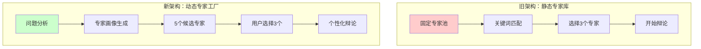
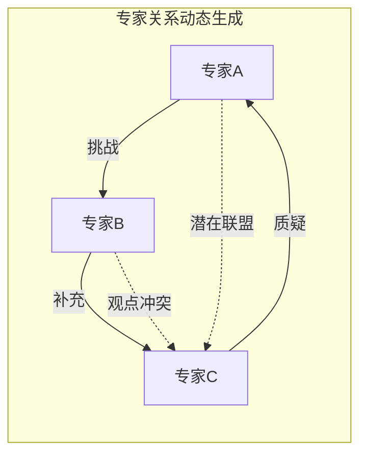

# 动态专家辩论系统设计方案
>
> 从固定专家到智能生成：重新定义AI专家辩论的未来

## 📋 目录

1. [核心洞察与问题分析](#核心洞察与问题分析)
2. [新架构设计理念](#新架构设计理念)
3. [智能专家生成系统](#智能专家生成系统)
4. [增强型辩论流程](#增强型辩论流程)
5. [创新功能设计](#创新功能设计)
6. [技术实现方案](#技术实现方案)
7. [未来发展路线](#未来发展路线)

## 核心洞察与问题分析

### 🎯 当前系统的根本局限

当前系统的最大问题在于**过度依赖预设专家模型**。这导致了以下问题：

1. **专业深度不足**
   - 13个内置专家 + 少量自定义专家无法覆盖人类知识的广度
   - 对于技术细节、专业领域问题，通用专家给出的是"正确的废话"
   - 专家的专业背景与问题领域不匹配时，辩论质量大幅下降

2. **静态匹配困境**
   - 关键词匹配无法理解问题的深层含义
   - 无法处理跨领域、复合型问题
   - 推荐结果机械化，缺乏灵活性

3. **价值错位**
   - 系统真正的价值在于**多轮反思的PK流程**，而非具体的专家人设
   - 当前设计本末倒置，过分强调专家身份而忽视了辩论机制的价值

### ✨ 核心价值重新定位

**系统的真正价值**：通过"独立思考 → 交叉辩论 → 最终立场 → 智慧综合"的多轮PK流程，实现类似强化学习的思维提升效果。

## 新架构设计理念

### 🏗️ 从"专家库"到"专家工厂"

**核心转变**：将系统从静态的"专家图书馆"转变为动态的"专家制造工厂"。



### 🎭 设计原则

1. **问题驱动**：专家服务于问题，而非问题迁就专家
2. **动态生成**：每个专家都是为特定问题量身定制
3. **智能组合**：确保专家组合的多样性和互补性
4. **保留经典**：优秀的内置专家仍可参与推荐

## 智能专家生成系统

### 🤖 三层专家生成架构

```yaml
第一层 - 问题理解层：
  - 深度分析问题的领域、层次、目标
  - 识别需要的专业知识和思维模式
  - 提取问题的核心矛盾和关键点

第二层 - 专家设计层：
  - 基于问题特征生成专家画像
  - 确保专家视角的差异性和互补性
  - 平衡专业深度与思辨广度

第三层 - 人格塑造层：
  - 赋予专家独特的思维方式和表达风格
  - 设定专家间的潜在冲突点
  - 注入适度的个性特征增强辩论活力
```

### 🎯 专家生成策略

#### 1. **混合推荐模式**

```javascript
推荐池 = {
  内置专家: 1-2位（如果高度相关）,
  自定义专家: 0-1位（如果存在匹配）,
  智能生成: 2-4位（针对性定制）
}
// 确保总数为5，供用户选择
```

#### 2. **智能生成示例**

**问题**："如何设计一个高并发的分布式缓存系统？"

**智能生成的专家**：

1. 🏗️ **马丁·福勒** - 软件架构大师，强调简洁设计
2. 💾 **Doug Cutting** - Hadoop创始人，分布式系统先驱
3. ⚡ **Antirez** - Redis作者，缓存系统专家
4. 📊 **Jeff Dean** - Google系统架构师，性能优化大师
5. 🔧 **Werner Vogels** - Amazon CTO，大规模系统实践者

#### 3. **专家差异化设计**

确保生成的专家在以下维度有所差异：

- **理论 vs 实践**：学者型 vs 工程师型
- **保守 vs 激进**：稳健派 vs 创新派  
- **宏观 vs 微观**：架构师 vs 细节控
- **成本 vs 性能**：商业思维 vs 技术极致

### 🌟 创新：专家关系图谱



系统不仅生成专家，还预设他们之间的关系：

- **天然盟友**：某些观点上可能结盟
- **思想对手**：在核心理念上存在冲突
- **互补关系**：各自擅长不同方面

## 增强型辩论流程

### 🔄 自适应轮次设计

摒弃固定4轮模式，采用**智能轮次系统**：

```python
轮次配置 = {
    "简单问题": 2轮（快速洞察 + 综合）,
    "标准问题": 4轮（经典流程）,
    "复杂问题": 6轮（深度探讨 + 多次交锋）,
    "开放辩论": 用户控制（手动推进）
}
```

### 🎭 动态辩论模式

#### 1. **快速咨询模式**（2轮）

- 第1轮：专家快速给出核心观点
- 第2轮：综合形成行动建议

#### 2. **标准辩论模式**（4轮）

- 保持现有的经典流程

#### 3. **深度探讨模式**（6轮）

- 增加"方案细化"和"风险评估"轮次
- 适合重大决策和复杂问题

#### 4. **自由辩论模式**

- 用户可随时介入提问
- 专家可针对性回应
- 支持追问和深挖

### 📊 辩论质量监控

```yaml
质量指标:
  - 观点新颖度: 是否提出独特见解
  - 论证深度: 论据是否充分有力
  - 互动质量: 专家间是否真正交锋
  - 实用价值: 是否产生可行方案
  
动态调整:
  - 质量不足时自动增加轮次
  - 达到高质量时可提前结束
  - 用户可随时干预流程
```

## 创新功能设计

### 🚀 突破性功能

#### 1. **专家进化系统**

```javascript
// 专家在辩论中学习和成长
专家状态 = {
  初始立场: "基于专业背景的观点",
  中期调整: "吸收其他专家的合理观点",
  最终立场: "综合后的成熟见解"
}
```

#### 2. **问题分解器**

将复杂问题自动分解为多个子问题，每个子问题可以有不同的专家组合：

```
主问题：如何创建一个成功的AI创业公司？
├── 子问题1：技术选型和产品定位 → 技术专家组
├── 子问题2：融资和商业模式 → 商业专家组
└── 子问题3：团队建设和文化 → 管理专家组
```

#### 3. **专家工作坊模式**

不同于辩论，专家们协作解决问题：

- 头脑风暴阶段：自由碰撞
- 方案整合阶段：形成共识
- 行动计划阶段：制定步骤

#### 4. **时间机器功能**

让不同时代的专家对话：

- 古代哲学家 vs 现代科学家
- 工业时代企业家 vs 数字时代创业者
- 历史经验 vs 未来趋势

### 💡 用户体验创新

#### 1. **智能问题优化**

```javascript
用户输入: "怎么赚钱？"
系统优化: "作为一个[您的背景]，如何在[时间范围]内，
          通过[可能的途径]实现[具体金额]的收入目标？"
```

#### 2. **可视化辩论图谱**

- 实时展示专家观点的convergence/divergence
- 标注关键转折点和精彩交锋
- 支持回放和重点标注

#### 3. **结论可操作性评分**

每个辩论结束后，系统评估：

- 💡 洞察深度（1-10分）
- 🎯 方案可行性（1-10分）
- 📋 行动清晰度（1-10分）
- ⚡ 创新程度（1-10分）

## 技术实现方案

### 🏗️ 分阶段实施路线

#### Phase 1：最小可行性版本（MVP）

```python
class DynamicExpertSystem:
    def analyze_question(self, question: str) -> QuestionProfile:
        """深度分析问题特征"""
        
    def generate_expert_pool(self, profile: QuestionProfile) -> List[Expert]:
        """生成5个候选专家"""
        
    def create_expert_persona(self, requirements: Dict) -> Expert:
        """动态创建专家人设"""
```

#### Phase 2：智能化增强

- 引入问题分解能力
- 实现自适应轮次
- 添加质量监控

#### Phase 3：交互体验升级  

- 可视化辩论过程
- 支持实时干预
- 多模式切换

### 🔧 关键技术点

1. **保持MCP协议兼容性**
   - 所有智能仍由Host端LLM提供
   - Server端负责流程控制和状态管理

1. **专家生成模板系统**

```javascript
{
  "expert_template": {
    "name": "${生成的专家名}",
    "background": "${专业背景描述}",
    "thinking_style": "${思维特征}",
    "debate_strategy": "${辩论策略}",
    "knowledge_domains": ["${领域1}", "${领域2}"],
    "personality_traits": ["${特质1}", "${特质2}"],
    "potential_biases": ["${偏见1}", "${偏见2}"]
  }
}
```

1. **智能提示词工程**

为MCP Host端LLM提供结构化的生成指导，确保生成的专家质量。

## 未来发展路线

### 🌟 长期愿景

#### 1. **专家生态系统**

- 用户贡献的专家模板市场
- 专家评分和排名系统
- 基于效果的专家推荐

#### 2. **学习型系统**

- 从历史辩论中学习最佳实践
- 自动优化专家生成策略
- 个性化推荐算法

#### 3. **多模态辩论**

- 支持图表、数据可视化
- 专家可以"画图"解释
- 引入实时数据支持论证

### 🎯 成功指标

1. **用户满意度**：辩论结果的实用性评分
2. **专业匹配度**：专家与问题的相关性
3. **思维提升度**：用户获得的新洞察数量
4. **决策支持度**：帮助用户做出决策的效果

## 结语

这个新设计将Guru-PK从一个"固定专家辩论系统"升级为"智能专家工厂"，真正发挥了MCP Host端LLM的智能优势，同时保留了多轮PK流程的核心价值。

**核心理念**：让AI不仅模仿既定的专家，更要根据问题的需要，创造出最合适的"专家"来进行高质量的思辨。

这不仅是一个技术升级，更是一个理念革新——从"我们有什么专家"到"你需要什么专家"的根本性转变。
